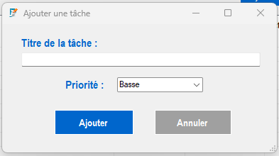
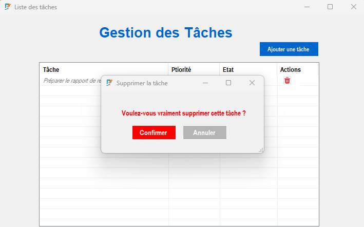
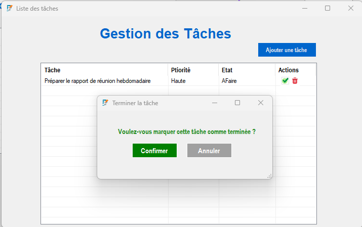

## 🗂️ GestTaches - Gestionnaire de Tâches

**GestTaches** est une application Windows Forms développée en C# pour gérer facilement des listes de tâches avec priorités.  
Elle permet d’ajouter, afficher, terminer, supprimer, sauvegarder et restaurer les tâches à partir d’un fichier JSON.

---
## 🖼️ Aperçu de l'application

| Accueil | Ajout d'une tâche | Formulaire d'ajout |
|--------|-------------------|---------------------|
|  |  |  |

| Suppression | Validation de tâche terminée |
|-------------|------------------------------|
|  |  |

### 🔧 Fonctionnalités clés

- Ajout de tâches avec priorité (Haute, Moyenne, Basse)
- Affichage trié automatiquement par priorité
- Marquage visuel des tâches terminées
- Suppression avec confirmation
- Sauvegarde automatique dans un fichier JSON
- Interface ergonomique (icônes, couleurs, accessibilité)

---

### 📁 Structure du projet (Architecture Clean)

- `GestTaches.Core` : logique métier et modèles
- `GestTaches.Data` : gestion des données (fichiers JSON)
- `GestTaches.Views` : interface utilisateur WinForms
- `Assets` : icônes et ressources
